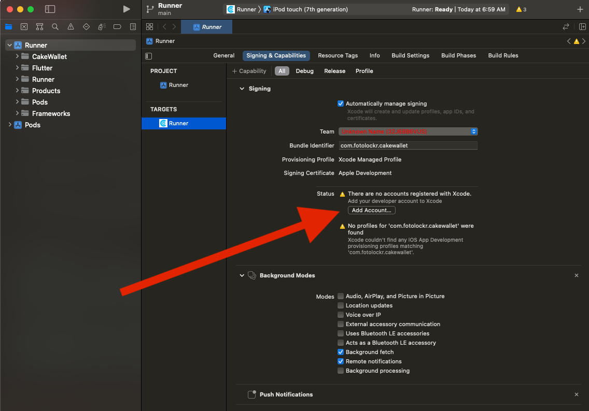

# Building CakeWallet for iOS

## Requirements and Setup

The following are the system requirements to build CakeWallet for your iOS device.

```
Machine running MacOS
Xcode
Homebrew
Flutter 2.0.4 or above
	- Android SDK 28
```

## Building CakeWallet

These steps will help you configure and execute a build of CakeWallet from its source code.

### 1. Installing Package Dependencies

CakeWallet cannot be built without the following homebrew packages installed on your build system.

- autoconf

- cmake

- pkg-config


You may easily install them on your build sytem with the following command:

`$ brew install autoconf cmake pkg-config`

### 2. Installing Android Studio and Android toolchain

You may download and install the latest version of Android Studio [here](https://developer.android.com/studio#downloads). After installing, start Android Studio, and go through the "Setup Wizard." This installs the latest Android SDK, Android SDK Command-line Tools, and Android SDK Build-Tools, which are required by CakeWallet. **Be sure you are installing SDK version 28 or later when stepping through the wizard**

### 3. Installing Flutter

Need to install Flutter with version `2.0.4`.

```
$ git clone https://github.com/flutter/flutter.git -b 2.0.4
$ export PATH="$PATH:`pwd`/flutter/bin"
$ flutter precache
```

Note: The last command only makes Flutter tools usable for the current terminal window. To permanently add Flutter to your system's terminal sessions, please update your `.zprofile` or equivalent.

### 4. Verify Installations

Verify that the Android toolchain, Flutter, and Android Studio have been correctly installed on your system with the following command:

`$ flutter doctor`

The output of this command will appear like this, indicating successful installations. If there are problems with your installation, they **must** be corrected before proceeding.
```
Doctor summary (to see all details, run flutter doctor -v):
[✓] Flutter (Channel stable, 2.0.4, on macOS 12.0, locale en_US.UTF-8)
[✓] Android toolchain - develop for Android devices (Android SDK version 28)
[✓] Android Studio (version 4.0)
[✓] Xcode - develop for iOS and macOS
```

### 5. Acquiring the CakeWallet Source Code

`$ git clone https://github.com/cake-tech/cake_wallet.git --branch main`

Change into the iOS scripts directory, then run the build script.

```
$ cd cake_wallet/scripts/ios/
$ ./build_all.sh
$ cd ../../
```

### 6. Log into your Apple Developer account (free)

You must be logged into a free Apple Developer account to build CakeWallet with Xcode. Please run the following command and navigate to the button shown below to log in before proceeding.

`$ open ios/Runner.xcworkspace -a xcode`



### 7. Prepare the project

```
$ cd cw_core && flutter pub get && flutter packages pub run build_runner build --delete-conflicting-outputs
$ cd ..
$ cd cw_monero && flutter pub get && flutter packages pub run build_runner build --delete-conflicting-outputs
$ cd ..
$ cd cw_bitcoin && flutter pub get && flutter packages pub run build_runner build --delete-conflicting-outputs
$ cd ..
```

Now it is time to pick your build product. The following three commands will allow you to specify `monero.com` or `cakewallet` as your build product for the source code.

```
$ cd scripts/ios
$ source ./app_env.sh <monero.com OR cakewallet>
$ ./app_config.sh
```

### 8. Flutter Commands

Install Flutter package dependencies with this command:

`$ flutter pub get`

Your CakeWallet binary will be built with cryptographic salts, which are used for secure encryption of your data. You may generate these secret salts with the following command:

`$ flutter packages pub run tool/generate_new_secrets.dart`

Then we need to generate localization files.

`$ flutter packages pub run tool/generate_localization.dart`

Lastly, we will generate mobx models for the project.

`$ flutter packages pub run build_runner build --delete-conflicting-outputs`

### 9. Build!

`$ flutter build ios --release`

Copyright (c) 2021 Cake Technologies LLC.
